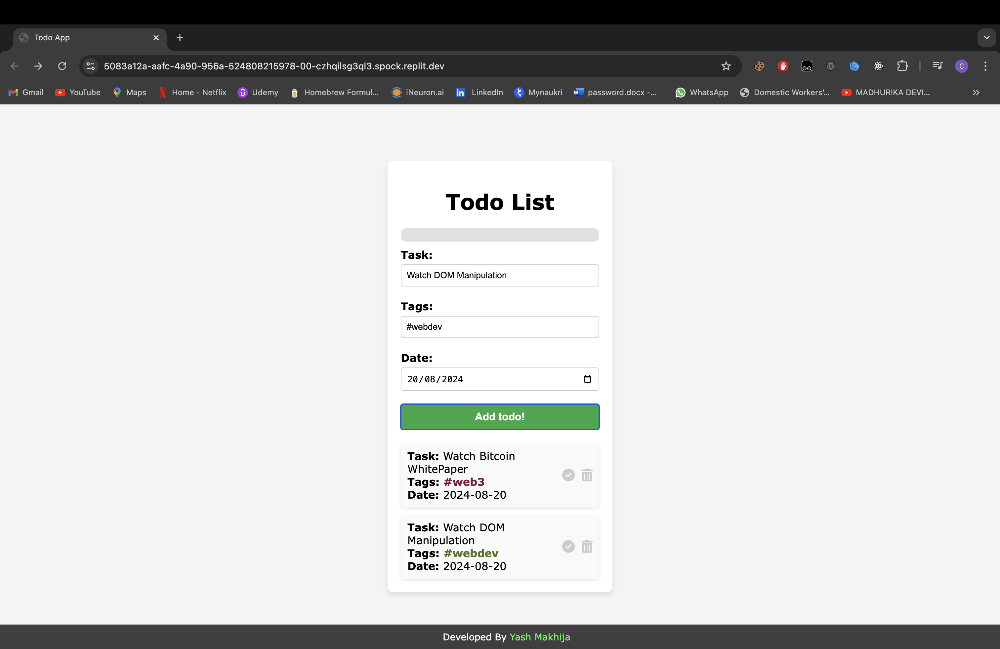
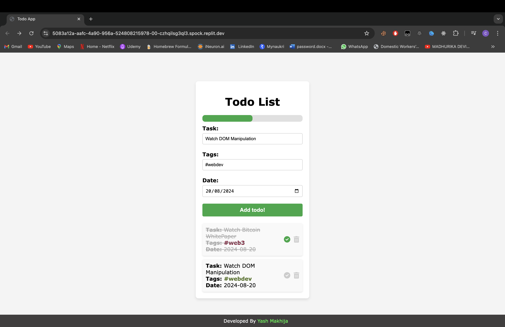
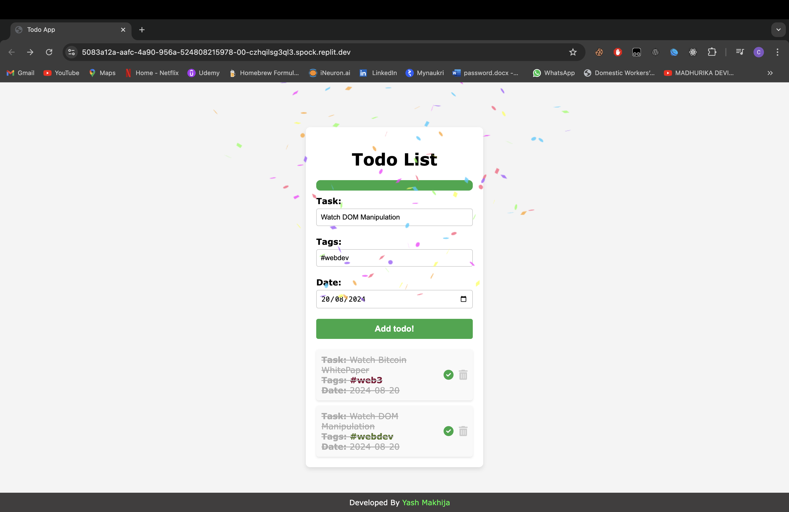

# Todo App

A simple and interactive Todo App that allows users to add, complete, and delete tasks. The app also features a progress bar that tracks the completion of tasks, and a celebratory confetti animation is triggered when all tasks are completed.

## Features

- **Add Task**: Allows you to add new tasks with optional tags and a due date.
- **Mark as Complete**: Mark tasks as complete, which strikes through the task text and updates the progress bar.
- **Delete Task**: Delete tasks from the list, updating the progress accordingly.
- **Progress Bar**: A visual indicator of the percentage of tasks completed.
- **Confetti Celebration**: A fun confetti animation is triggered when all tasks are marked as complete.
- **Responsive Design**: The app is responsive and works well on mobile devices.

## Technologies Used

- **HTML**: Structure of the application.
- **CSS**: Styling and layout, including responsive design for mobile devices.
- **JavaScript**: Functionality for adding, completing, deleting tasks, updating the progress bar, and triggering confetti.
- **Font Awesome**: Icons used for marking tasks as complete and for deleting tasks.
- **Canvas Confetti**: A JavaScript library for the confetti animation.

## Setup and Installation

1. Clone the repository:

   ```
   git clone https://github.com/yashmakhija/100xdevs-cohort-3-assigments/tree/main/week-3/Todo%20using%20Dom
   ```

2. Navigate to the project directory:

    ```
    cd todo-app
    ```
Open the index.html file in your browser to run the application:

3. On macOS or Linux:
    ```
    open index.html
    ```

4. On Windows:

    ```
    start index.html
    ```
Alternatively, you can manually navigate to the project folder and double-click the index.html file to open it in your default browser.

## Screenshots





## Customization
- **Styling:** Customize the styles in the style.css file to change the appearance of the app.
- **Icons:** The app uses Font Awesome for icons. You can change the icons by modifying the HTML and corresponding classes.
- **Confetti Animation:** Adjust the confetti settings in the triggerConfetti() function in the script.js file to change the animation effect.

## Contributing
Contributions are welcome! Please feel free to submit a Pull Request with your changes.

## License
This project is licensed under the MIT License. See the LICENSE file for details.


### Explanation:
- **Clone the Repository:** This section explains how to clone the repository using Git.
- **Navigate to the Project Directory:** Users are instructed to change their working directory to the project's folder.
- **Open `index.html`:** Provides instructions for running the app by opening the `index.html` file in a browser.
- **Screenshots:** Placeholder for a screenshot of your app, which you can update with an actual image.
- **Customization:** Details on how to customize the appearance and behavior of the app.
- **Contributing:** Encourages others to contribute to the project via Pull Requests.
- **License:** Specifies that the project is licensed under the MIT License.
- **Author:** Credits you, Yash Makhija, as the developer, with a link to your profile.
